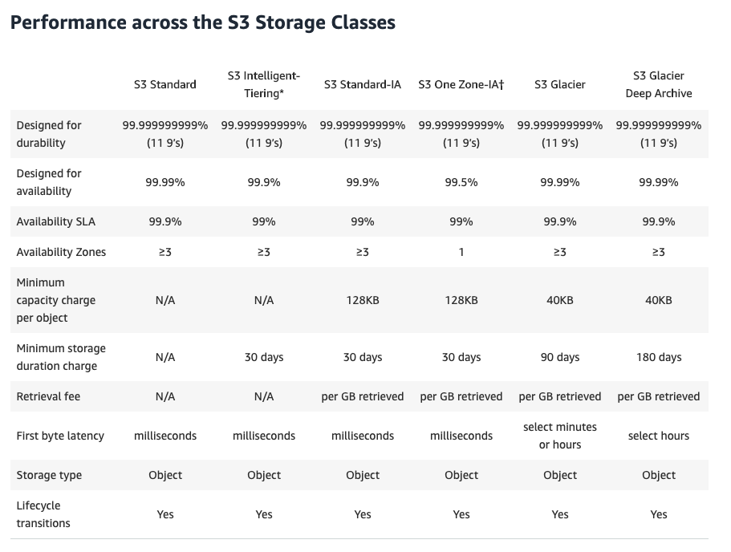

# S3101

what is s3?

s3 provides developers with secure, durable, highly scalable object storage. Amz S3 is easy to use, with a simple web services interface to store and retrieve any amount of data from anywhere on the web

The basics of s3 are as follows:

* s3 is **object-based**. i.e. allows you to upload files
* files can be from 0Bytes to 5TB
* there is unlimited storage
* files are stored in **Buckets**
* s3 is a universal namespace. That is , names must be **unique globally**. (Because it's actually creating a web address)
* when you upload a file to s3, you will receive a http 200 code if the uplaod was successful to your browser

S3 is object based. Think of objects just as files. Objects consist of the following:

* Key (name of the object)
* value (data)
* version ID
* metadata (data about data)
* subresources: token, access control lists, ...

How does data constency work for S3?

* Read after write consistency for PUTS of new objects: if you make a HEAD or GET request to a key name before the object is created, then create the object shortly after that, a subsequent GET might not return the object due to eventual consistency.

* Eventual Consistency for overwrite PUTS and DELETES (can take some time to propagate): until the process is completed, your results might be the older version.

S3 has the folling features:

* tiered storage available
* lifecycle management
* versionning
* encryption
* MFA delete: if a person want to delete a file then multi factor authentification will happen
* secure your data using **access control lists** and **bucket policies**

S3 storage classes

* S3 standard
* S3 - IA (Infrequently Accessed): for data that is accessed less frequently, but requires rapid access when needed. Lower fee than S3 but you are charged a retrieval fee
* S3 One Zone - IA: for where you want a lower-cost option for infrequently accessed data, but do not require the multiple Availability Zone data resilience.
* S3 intelligent Tiering: Desinged to optimize costs by automatically moving data to the most cost-effective access tier, without performance impact or operational overhead
* S3 Glacier: is a secure, durable, low-cost storage class for data archiving and long-term backup. You can reliably store any amount of data at costs that are competitive with or cheaper than on-premises solutions. Retrieval times configurable from minutes to hours.
* S3 Glacier Deep Archive: S3 Glacier Deep Archive is Amazon S3's lowest cost storage class where a retrieval time of 12 hours is acceptable.

S3 comparision

(Ref: `https://aws.amazon.com/s3/storage-classes/`)
