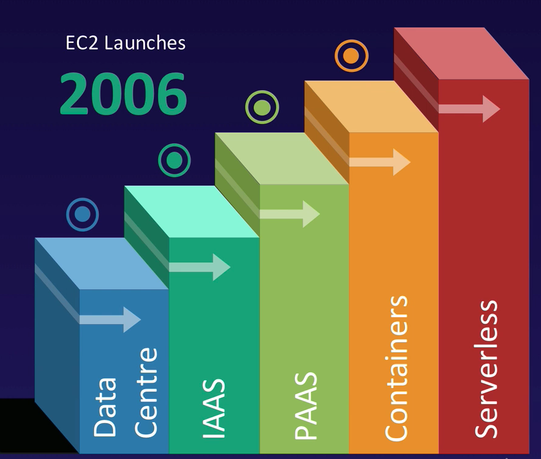

# Lambda

## A brief history of cloud

Data Centre -> IAAS -> PAAS -> Containers -> Serverless
/var/folders/hd/_bw5tng539jdl_yjhbtc40sh0000gn/T/TemporaryItems/(A Document Being Saved By screencaptureui)/Screen Shot 2020-11-08 at 23.45.15.png

## What is lambda

AWS lambda is a compute service where you can upload your code and create a Lambda function. AWS Lambda takes care of provisioning and managing the servers that you use to run the code. You don't have to worry about operating systems, patching, scaling, etc. 

## You can use Lambda in following wats

As an event-drivent compute service where AWS Lambda runs your code in response to events. These events could be changes to data in an Amazon S3 bucket or an Amazon DynamoDB table.

As a compute service to run your code in response to HTTP requests using Amazon API Gateway or API calls made using AWS SDKs. This is what we use at A Cloud Guru.

## How is Lambda Priced

**Number of Requests**  
First 1 million requests are free. $0.20 per 1 million requests thereafter

**Duration**  
Duration is calculated from the time your code begins executing until it returns or otherwise terminates, rounded up to the nearest 100ms. The price depends on the amount of memory you allocate to your function. You are charged $.00001667 for every GB-second used.
