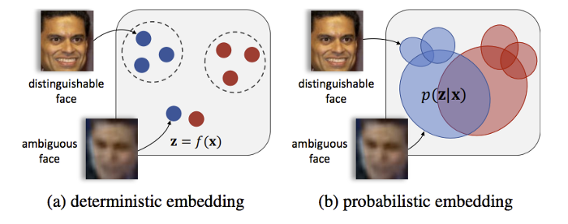

# Face recognition
sorry for my fake english

## 1. What is face recognition:
There are two main tasks that facial recognition models perform: 
1. Face verification: comparing an input face to an already known face. 
2. Recognition: comparing an input face to a database of multiple face identities. 

## 2. How does face recognition work?
At a basic level, face recognition models follow these steps:
* An input image is fed to the algorithm 
* The algorithm creates a facial embedding for the input image
* The algorithm compares the input image's embedding to the embedding of known faces in the database.

## 3. Training:
Most systems employ triplet loss for the training of the algorithm 

## 4. Face embedding:
There are two types of face embedding: deterministic face embedding (DFE) and probabilistic face embedding (PFE). So, what are DFE and PFE?

### 4.1. Deterministic face embedding (DFE):
a face is a point (or vector) in embedding space

### 4.2. Probabilistic face embedding (PFE)
a face is a distribution in embedding space rather than a point of estimation. 

<TODO: FaceNet explaination>
